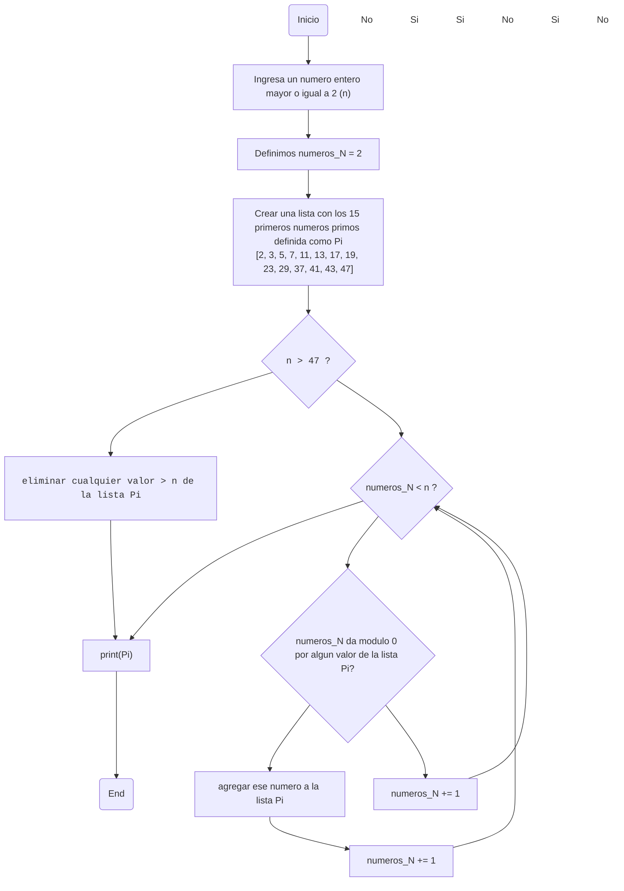

# N-IPrimos
## Descripcion
Plantear el algoritmo para obtener los números primos hasta n
### Aclaraciones
Queremos verificar si X(El numero que escribamos) es primo y lo que tengo planeado esta relacionado con un metodo que nos enseño un profesor de matematicas que MUY posiblemente sea correcto por lo que estaria mas enfocado en valores grandes


El planteamiento seria asi
## Pseudocodigo
```python
n : entero >= 2
Pi = [2, 3, 5, 7, 11, 13, 17, 19, 23, 29, 37, 41, 43, 47] #Lista con los primeros 15 numeros primos

numeros_N = 2

if n > 47
  ejecutar un bucle mientras numeros_N < n ,si numeros_N >= n rompe el bucle
    if numeros_N da modulo 0 por algun valor de la lista Pi
      numeros_N += 1
    else
      agregar ese numero a la lista Pi
      numeros_N += 1
  print (Pi)
else
  eliminar cualquier valor de la lista Pi > n
  print (Pi)
```

Si un número pasa la prueba de no ser divisible por los primeros 15 primos, es un buen indicio de que es primo, aunque no garantiza con certeza que lo sea 

## Diagrama de flujo

